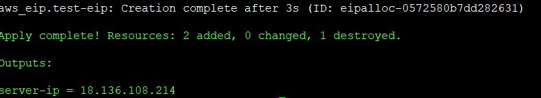

# Hello from Rails
Rails is saying hello to the World

## There are some ways to provisioning Hello-W0rld rails app

### Requirements: 
Install `terraform` before continues to the next steps:
[link](https://www.terraform.io/intro/getting-started/install.html)

e.g: Install terrafrom On `ubuntu 16.04`: 

```
# wget https://releases.hashicorp.com/terraform/0.11.1/terraform_0.11.1_linux_amd64.zip

```

```
# unzip terraform_0.11.1_linux_amd64.zip

```

```
# sudo mv terraform /usr/local/bin/

```
Then check whether it works with the command `terraform --version`

Please make sure that you have a valid `"aws_access_key"` and `"aws_secret_key"` in file `variables.tf`:

```bash
# AWS Config

variable "aws_access_key" {
  default = "<your access key>"
}

variable "aws_secret_key" {
  default = "<your sescret key>"
}

variable "aws_region" {
  default = "ap-southeast-1"
}
```

## How to run the project

App will run on an EC2 instance, `cd` into repo folder then first run `terraform init`

```
# terraform apply
```

Wait for a couple of minutes then we will get the ip from AWS instance:  


Then execute the command: 

```bash
ssh -i id_rsa ubuntu@<server_ip> 'bash -s' < script.sh
``` 

Access the `Hello-World page` by access the public ip and port `3000`


NOTE!!!: please be sure that the port 3000 has not been occupied

